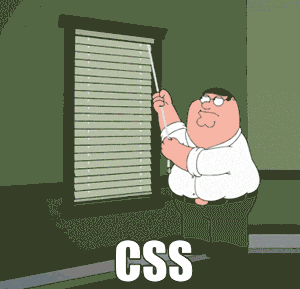
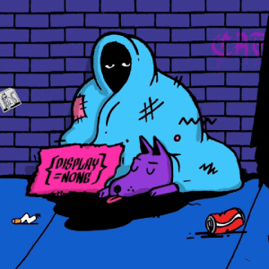

+++
date = '2025-02-05T02:57:15+01:00'
draft = false
title = 'Proč se vyhnout vanilla CSS a využívat Tailwind CSS 🌊'
[cover]
  image = "images/tailwind-css-thumbnail.webp"
  alt = "Tailwind CSS - moderní stylování"
  caption = "Ukázka stylování s Tailwind CSS"
  relative = false
+++

## Kde se CSS vzalo? 🤷🏻‍♂️

**CSS tady bylo, je a i bude**. To se dá říct ale i o strojovém kódu a píše ho snad někdo ručně? Ne! Lidi se vyvýjejí a nyní už je stejná blbost psát ve vanilla CSS jako psát strojový kód. V tomto objektivním článku si řekneme proč tomu tak je a **proč už bych nikdy po vanilla CSS nesáhl** a proč jsem tak **rád že Tailwind CSS vůbec existuje!**

### Disclaimer ℹ️
V prvé řadě bych rád uvedl na pravou míru, že pokud se zrovna ty s weby učíš a programuješ si své weby v HTML, CSS a Javascriptu, tak nepřestávej! Je důležité znát tyto technologie a je důležité je znát od začátku a umět pracovat s tímto minimem, aby se na to později mohly nalepit pokročilejší technologie, které vám již otevřou nové obzory a zároveň budete chápat souvislosti.

HTML, CSS a JS jsem miloval z toho důvodu, že nebylo potřeba nic nastavovat, nic instalovat a nic konfigurovat a všechno tak nějak fungovalo bez ničeho a to mě tak nějak neodradilo přestat a naučit se je.

## Co je na CSS tak špatného? 📉
Co je na CSS špatného? Vlastně nic, ale zároveň všechno. Začněme třeba u specifikování selektorů:

### Selektory jsou peklo 🔥 selector hell

Kdo někdy pracoval na větším projektu s vanilla CSS, tak ví, že v tom rychle vznikne bordel. Stylování jedné komponenty ovlivní něco úplně jiného někde úplně jinde a díky dědičnosti se v kódu rychle začnete ztrácet. Nabízí se tedy otázka - Proč to všechno složitě vymýšlet, když to můžeme obejít elegantněji například pomocí takového [CSS Frameworku](https://tailwindcss.com/)? 🤔

#### Výmýšlení stovek a stovek názvu tříd a selektorů už prostě nemá dnes smysl...
- Má vůbec v dnešní uspěchané době vymýšlet všechny ty názvy tříd pro **pododstavec odstavce třetího sloupce ve druhé tabulce na čtvrté stránce**?
- Hm... a jak pojmenuju tento element? Už vím! Co třeba `.page-wrapper .content-container .fourth-page .data-table:nth-of-type(2) .third-column .paragraph-wrapper .sub-paragraph:nth-child(2) .why-is-this-so-specific .please-make-it-stop .naming-conventions-have-failed-us .css-is-my-enemy .send-help-im-trapped-in-a-selector-nightmare .octopus-oculus`
- Tohle se vám vážné líbí?

### CSS soubory se rychle nafouknou 🐡

Pokud píšete CSS klasicky, máte několik možností: buď budete mít obří soubor plný všeho možného, nebo stovky menších souborů, které se budou v produkci složitě spravovat. Tailwind tento problém řeší tím, že do produkce se dostane pouze ty styly, které skutečně používáte, díky PurgeCSS.

### Konzistence kódu ✍️✍🏻✍🏿
Když píšete vanilla CSS, každý vývojář má trochu jiný styl psaní, trochu jiné názvy tříd, jiný přístup k organizaci kódu a taky je každý trochu jinak psychicky narušený. V Tailwindu tohle neřešíte – všechny utility jsou dané, nemění se a vy jen skládáte UI jako LEGO.

### Rychlost vývoje ⏩📈
Tailwind šetří čas a peníze, protože nemusíte přepínat mezi HTML a CSS souborem a platit za psychoterapeuta. Vše děláte rovnou v HTML a okamžitě vidíte výsledek. Chcete přidat padding? p-4. Změnit barvu? bg-blue-500. Flexbox? flex. Hotovo.

## Ale Tailwind dělá HTML nečitelným! 👨🏻‍🦯‍➡️
Toto je nejčastější argument odpůrců Tailwindu... **HAHA dobrá tedy, ale toho se já zas tak nebojím**. Nevím jak vy, ale já toto klidně přijmu, pokud to znamená, že se nebudu muset crcat s výše zmíněnými nevýhodami s vanilla CSS.

## Kdy vanilla CSS dává smysl? 😅
Nebudu lhát – v některých případech je vanilla CSS pořád použitelné. Pokud děláte extrémně custom UI s netradičním designem, kde Tailwind nebude chápat, tak pak dává smysl psát vlastní styly. Ale v drtivé většině případů? Tailwind je lepší volba. Tečka.

## Shrnutí
- Tailwind šetří čas a nervy. ✅🤬
- Kód je konzistentní a přehledný. ✅🎨
- Produkční build je ultra malý díky PurgeCSS. ✅🤏🏻
- Neřešíte pojmenovávání tříd a selector hell. ✅🔥
- Nemusíte navštěvovat terapeuta. ✅👀

Takže pokud stále píšete vanilla CSS, možná nastal čas se nad sebou zamyslet.

**Tailwind je budoucnost a já už zpátky nepůjdu!**

